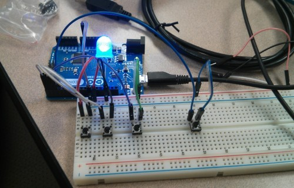

#RSS_Erator



Microkeyboard accessory that will help you cycle through your RSS feeds, view them and then close the windows.

- j to cycle forward
- k to cycle backward
- v to view
- ctrl + w to close that new window you just opened
- led to make it awesome

My Submission for ```#BrockHackFest```

